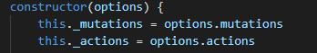
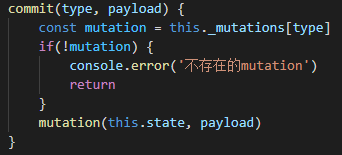
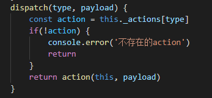
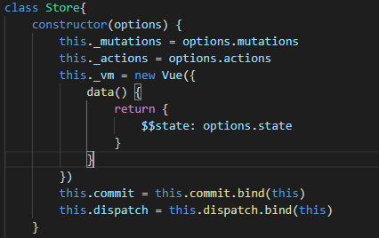

# 手写实现mini-vuex
最近系统复习了vuex的原理，并手写实现了一个mini-vuex。

#### 搭建基础架构

- 实现Store类
- 实现install方法

```javascript
let Vue
class Store{
    constructor() {

    }
}

function install(_vue) {
    Vue = _vue
}

export default { Store, install }
```

因为Vuex的实例是通过`new Vuex.Store()`来进行的，所以导出的结构便是`{ Store, install }`

#### 注册$store

调用了一下applyMixin方法，该方法主要作用就是在所有组件的**beforeCreate**生命周期注入了设置**this.$store**这样一个对象，核心代码如下 ：

```javascript
function install(_vue) {
    Vue = _vue
    Vue.mixin({
        beforeCreate() {
            // 根组件会存在store
            if(this.$options.store) {
                Vue.prototype.$store = this.$options.store
            }
        }
    })
}
```
#### 让state变成响应式数据
`Vuex`的`state`状态是响应式，是借助`vue`的`data`是响应式，将`state`存入`vue`实例组件的`data`中
```javascript
class Store{
    constructor(options) {
        this._vm = new Vue({
            data() {
                return {
                    $$state: options.state
                }
            }
        })
    }
    get state() {
        return this._vm._data.$$state
    }
    set state(v) {
        console.error('不能直接修改state')
    }
}
```

通过`new Vue`的方式进行代理响应式数据,并把`state`藏起来不让用户直接修改`state`

#### 实现commit
先保存`ations`和`mutations`

 

commit实现

 

commit(type, payload) 参数1是mutations的函数名称，根据type获取到mutations的函数然后执行它

我们的commit操作，本质上就是修改这个组件的data值 

#### 实现dispatch

我们看看actions里的函数的调用参数

```javascript
actions:{
    add({ commit, dispatch, state }, payload){}
}
```
所以我们可以看到actions里的函数的第一个参数其实就是Store实例

 

在constructor构造函数里绑定this

 


#### 总结

可见其的实现方式完完全全的使用了vue自身的响应式设计，依赖监听、依赖收集都属于vue对对象Property set get方法的代理劫持。最后一句话结束vuex工作原理，`vuex中的store本质就是没有`template`的隐藏着的vue组件；`


--------------------------------------------------------------------------------------------------------------------------------------------------------


在上面我们需要对commit，dispatch的进行this的绑定，因为不绑定this的话，this会为undefined，那么问题来了：

#### this为什么等于undefined

之所以要在constructor构造函数里绑定this，是因为如果不绑定this，commit调用的时候this是undefined，那么为什么this会等于undefined呢？

我们先回顾一下

‘运行环境’也是对象，this指向运行时所在的对象。

- 如果一个函数在全局环境运行，this就指向顶层对象（浏览器中为window对象） 。
- 如果一个函数作为某个对象的方法运行，this就指向那个对象 。
- 如果一个函数作为构造函数，this指向它的实例对象。 

箭头函数体内的`this`对象，就是[定义时所在的对象]，而不是使用时所在的对象 。

一般来说this最终都会指向window，为什么会出现undefined呢？

是因为用了严格模式**"use strict"**，[严格模式下无法再意外创建全局变量]，所以`this`不为`window`而为`undefined` 

**注意：**

箭头函数中，`this`指向运行时所在的对象，而`use strict`被移到函数内了，所以`this`为全局变量`window`。 

```javascript
const useName = () => {
    "use strict";
    console.log(this)
};
useName(); //Window
```


#### 完整代码

```javascript
let Vue
class Store{
    constructor(options) {
        this._mutations = options.mutations
        this._actions = options.actions
        this._vm = new Vue({
            data() {
                return {
                    $$state: options.state
                }
            }
        })
        this.commit = this.commit.bind(this)
        this.dispatch = this.dispatch.bind(this)
    }
    get state() {
        return this._vm._data.$$state
    }
    set state(v) {
        console.error('不能直接修改state')
    }
    commit(type, payload) {
        const mutation = this._mutations[type]
        if(!mutation) {
            console.error('不存在的mutation')
            return
        }
        mutation(this.state, payload)
    }
    dispatch(type, payload) {
        const action = this._actions[type]
        if(!action) {
            console.error('不存在的action')
            return
        }
        return action(this, payload)
    }
}

function install(_vue) {
    Vue = _vue
    Vue.mixin({
        beforeCreate() {
            // 根组件会存在store
            if(this.$options.store) {
                Vue.prototype.$store = this.$options.store
            }
        }
    })
}

export default { Store, install }
```

